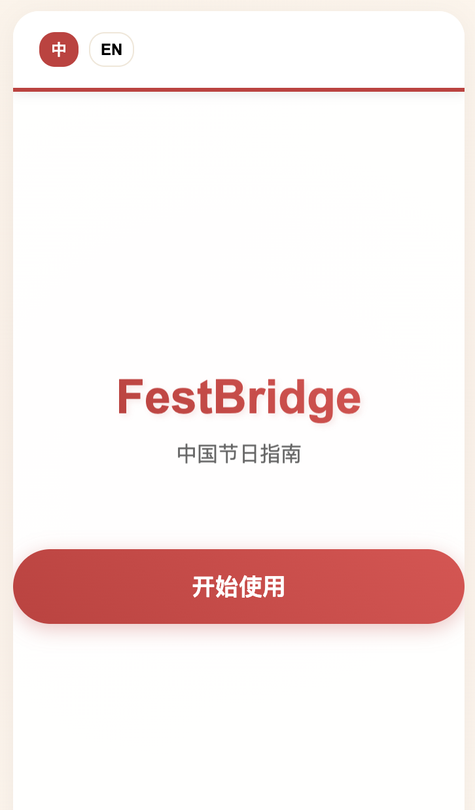
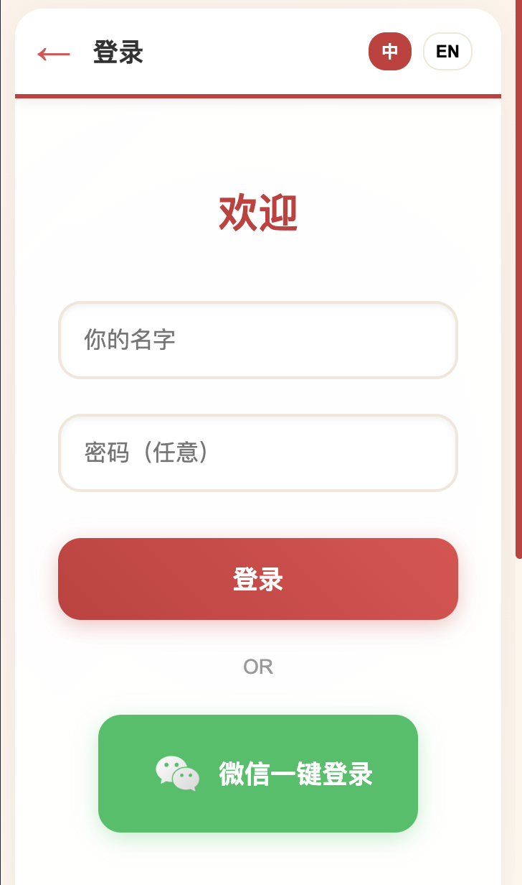
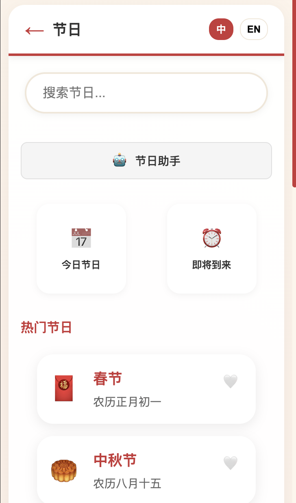
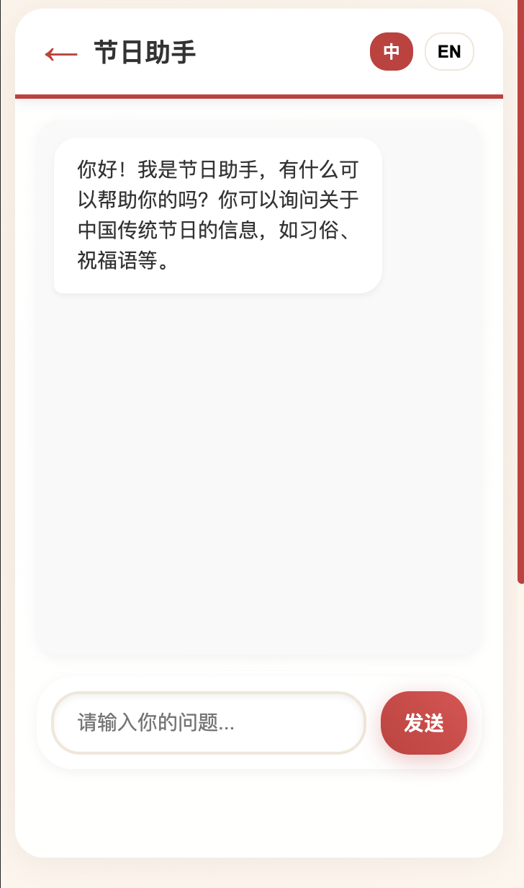
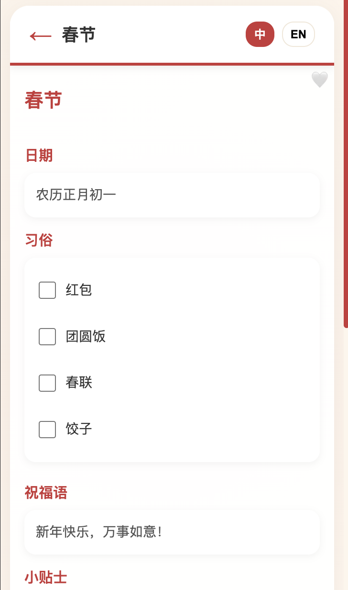
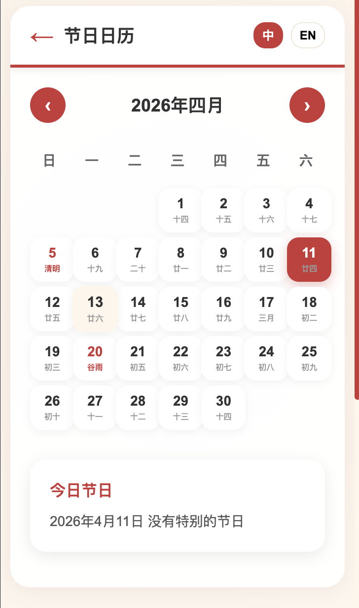
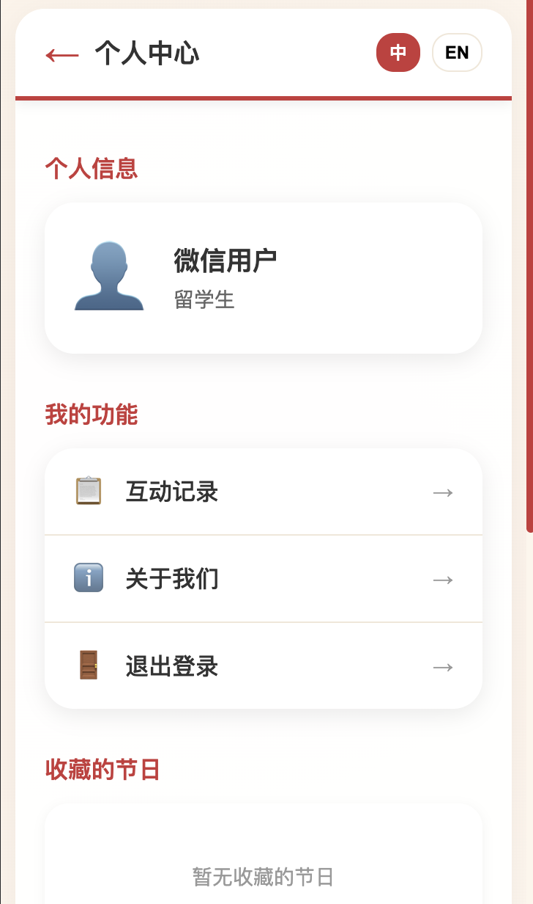

# FestBridge 🎉 中国节日指南

## 项目介绍 🌟

✨ **FestBridge** 是一款超可爱的小程序，专门帮助留学生顺利参与中国传统节日、避免文化尴尬～ 它就像你的贴心节日小助手，提供丰富的中国传统节日信息，包括节日时间、习俗含义、禁忌注意事项等，让你轻松融入中国文化！

## 功能特点 🎁

- 📅 **节日百科**：提供中国传统节日的详细信息，让你秒变节日专家
- 🤖 **智能助手**：随时解答节日相关问题，有问必答超贴心
- 📆 **节日日历**：查看节日日期，提前规划你的节日活动
- 👤 **个人中心**：管理你的收藏和设置，打造专属节日体验

## 界面展示 📸

### 1. 主页 🏠



### 2. 登录页面 🚪



### 3. 功能主页 ✨



### 4. 智能助手 🤖



### 5. 节日内容 📖



### 6. 节日日历 📆



### 7. 个人中心 👤



## 技术栈 🛠️

- 💻 HTML5
- 🎨 CSS3
- ⚙️ JavaScript
- 📱 响应式设计
- 🤯 智能API集成

## 如何运行 🚀

1. 🌟 克隆项目到本地
2. 📁 在项目根目录启动本地服务器
   ```bash
   python3 -m http.server 8000
   ```
3. 🌐 在浏览器中访问 `http://localhost:8000`

## 团队成员 👥

- **YEAP WEN HUEY** 🌟 - 产品经理、交互设计师、视觉设计师、市场调研与竞品分析、综合资料整理与项目总结、小程序初期页面设计、小程序页面制作、节日助手制作、PPT 制作、汇报
- **HO JIA YU** ✨ - 产品经理、交互设计师、视觉设计师、人物画像、信息架构、产品优化、汇报
- **YIN YIN NWE** 🎨 - 产品经理、交互设计师、视觉设计师、情景故事、产品功能、产品优化、汇报

## 项目目标 🌈

帮助留学生更好地了解和参与中国传统节日，减少文化差异带来的尴尬，促进跨文化交流与理解。让每个节日都成为美好的回忆～ 🎊