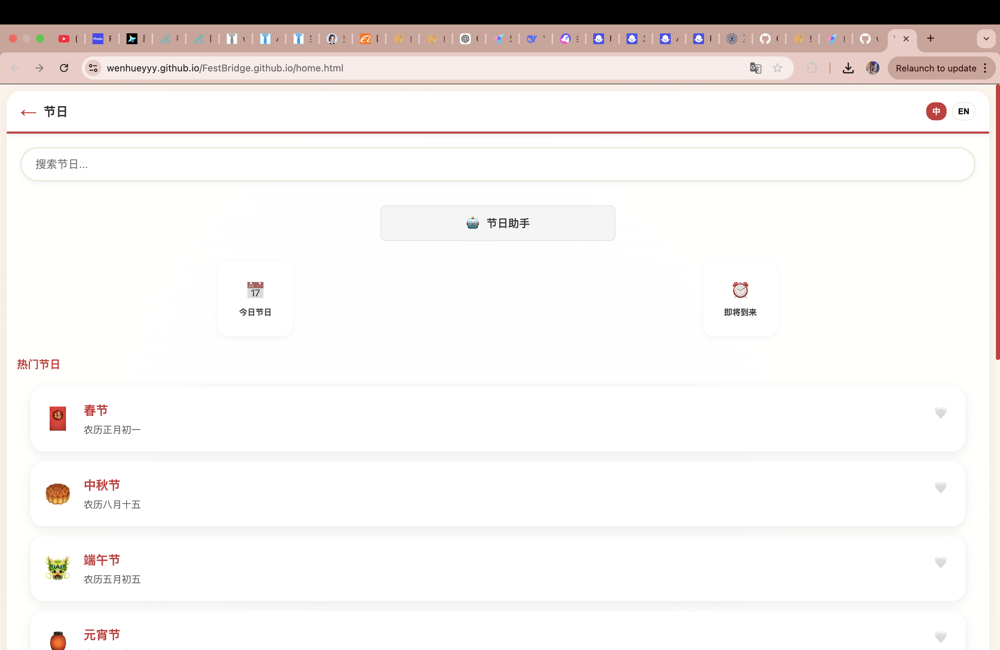
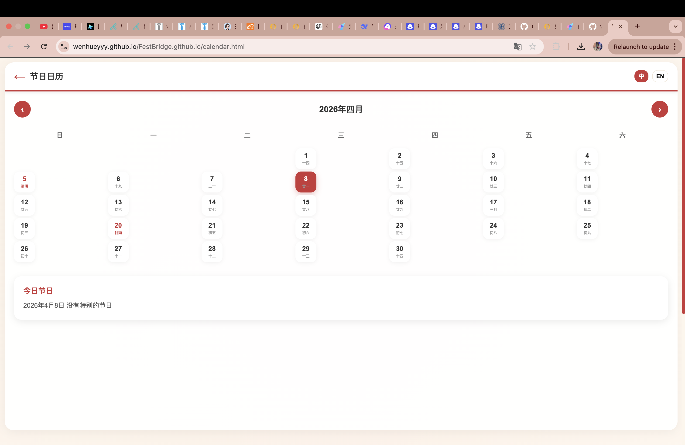
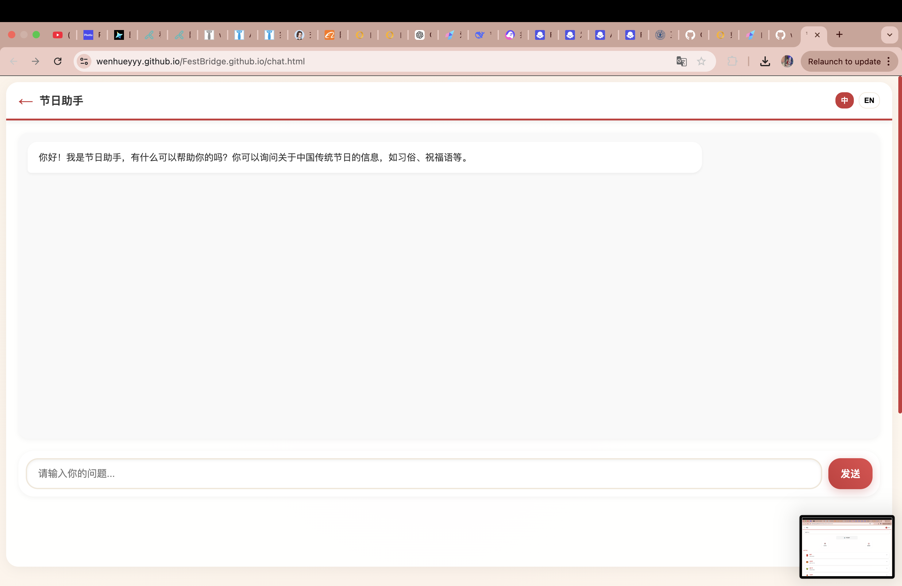
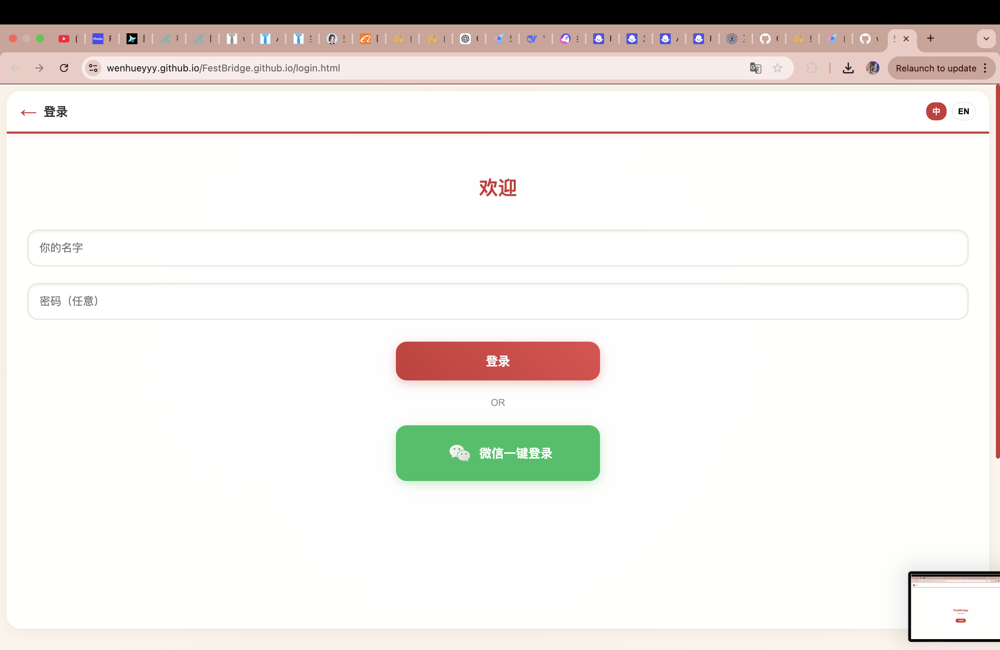

# 🏮 中国传统节日小程序 🏮

## 📋 项目概述

这是一个专注于中国传统节日的信息展示和智能助手项目，提供节日日历、详细信息、智能聊天等功能，支持中英文切换。

## 🎯 核心功能

### 📅 节日日历
- ✨ 展示公历和农历节日
- 🔗 点击节日自动跳转到详情页
- 🌐 支持中英文切换
- 🎨 格子大小一致，排版美观
- 📍 点击日期后在下方显示该日期的节日信息
- 🔖 节日栏中的节日名称可点击跳转详情页

### 💬 智能聊天助手
- 🤖 调用Coze API实现智能对话
- 🌊 支持流式响应（SSE）
- ⚡ 实时更新显示
- 💡 建议问题功能
- 🔧 英文空格修复
- 🛡️ 防重复发送机制

### 🌐 多语言支持
- 🌍 实现整体中英文顺畅切换
- 📝 使用lang.json存储多语言文本
- 🔄 动态更新页面元素
- 💾 本地存储用户语言偏好

### 📖 节日详情
- 📚 展示节日的详细信息
- 🎭 节日介绍
- 🏛️ 历史起源
- 🎪 传统习俗
- 🎁 祝福语
- 🛒 相关物品
- ⚠️ 文化注意事项

## 🎨 页面展示

### 🏠 主页


### 📅 节日日历


### 💬 智能聊天助手


### 🔐 登录页面


### 🎉 节日页面


## 🛠️ 技术实现

### 前端技术
- **HTML5**：页面结构
- **CSS3**：样式设计，包括响应式布局
- **JavaScript**：交互逻辑和功能实现
- **LocalStorage**：存储用户偏好和状态

### API集成
- **Coze API**：实现智能聊天功能
- **SSE (Server-Sent Events)**：处理流式响应
- **Fetch API**：网络请求

## 🌟 特色亮点

1. **智能聊天助手**：使用Coze API提供智能问答
2. **多语言支持**：完整的中英文切换功能
3. **用户体验**：流式响应、实时更新、建议问题
4. **视觉设计**：美观的日历排版和响应式布局
5. **功能完整性**：涵盖节日的各个方面信息

## 📱 使用指南

1. **访问主页**：打开`index.html`
2. **浏览日历**：点击`calendar.html`查看节日日历
3. **智能咨询**：点击`chat.html`与智能助手聊天
4. **查看详情**：点击节日名称查看详细信息
5. **切换语言**：使用语言切换按钮切换中英文

## 🌍 项目价值

- **文化传播**：推广中国传统节日文化
- **信息整合**：集中展示节日相关信息
- **智能交互**：提供智能问答服务
- **多语言支持**：方便国际用户了解中国文化
- **教育意义**：作为节日知识的学习资源

## 🚀 未来扩展

1. **添加更多节日**：扩展节日数据库
2. **增强智能助手**：提高AI回答的准确性和相关性
3. **添加用户贡献**：允许用户添加祝福语和习俗
4. **移动端优化**：进一步优化移动设备体验
5. **社交功能**：添加节日祝福分享功能

## 📁 项目结构

```
├── index.html          # 主页
├── calendar.html       # 节日日历
├── chat.html           # 智能聊天助手
├── detail.html         # 节日详情页
├── blessings.html      # 祝福语库
├── customs.html        # 节日习俗
├── items.html          # 必备物品
├── tips.html           # 文化避坑指南
├── upcoming.html       # 即将到来的节日
├── profile.html        # 个人中心
├── about.html          # 关于页面
├── css/                # 样式文件
├── js/                 # 脚本文件
├── images/             # 图片资源
└── README.md           # 项目文档
```

## 🎊 总结

本项目是一个功能完整、用户友好的中国传统节日信息平台，通过现代化的前端技术和智能API集成，为用户提供了丰富的节日信息和智能交互体验。项目不仅展示了中国传统节日的文化内涵，也通过多语言支持促进了文化传播，具有较高的实用价值和教育意义。

---

✨ **感谢使用中国传统节日小程序！** ✨

希望这个项目能帮助你更好地了解和体验中国传统节日文化！